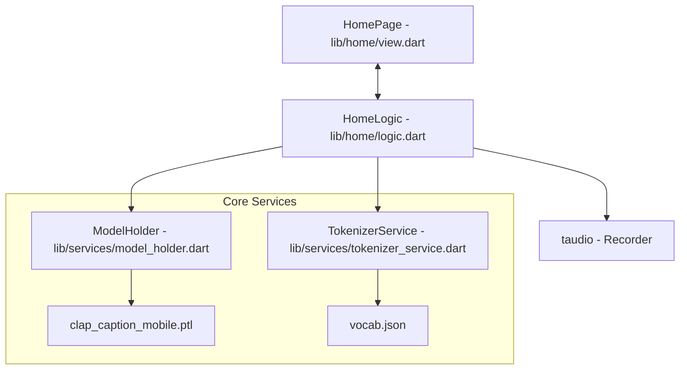
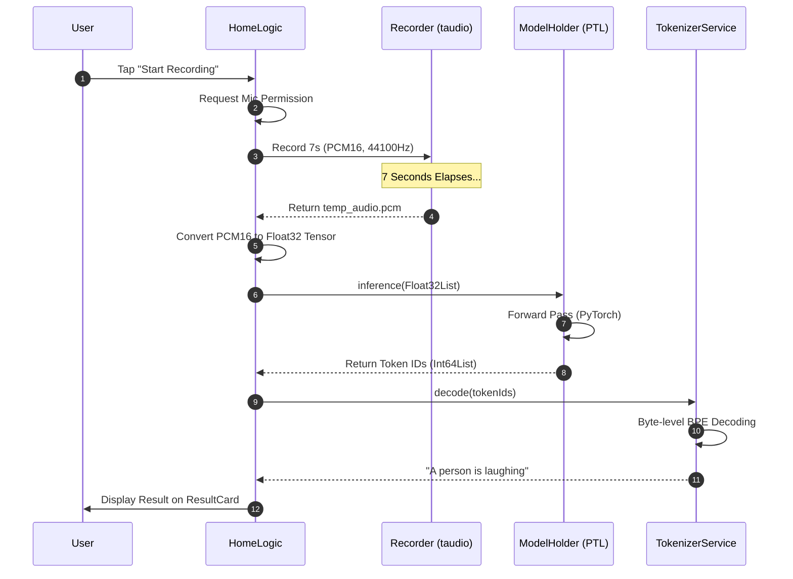

# Clap-Mobile Sound Recognition App

Clap-Mobile is a modern Flutter application designed for real-time environmental sound recognition. The app captures short bursts of audio and leverages a mobile-optimized version of **Microsoft CLAP (Contrastive Language-Audio Pretraining)** to generate descriptive captions of the acoustic environment.

## Main Purpose
The primary goal of this application is to provide users with an intelligent "acoustic-to-text" experience. By recording 7 seconds of ambient sound, the app uses a PyTorch Mobile model to understand the context and outputs a human-readable description (e.g., "A person is laughing" or "The sound of rain hitting a window").

## Tech Stack
- **Framework:** Flutter (Dart)
  - **State Management:** GetX
  - **Inference Engine:** `flutter_pytorch_lite` (PyTorch Mobile)
  - **Audio Management:** `taudio` (High-performance audio recording)
  - **Tokenizer:** Custom GPT-2 Byte-level BPE Decoder

## System Architecture

The app follows a clean, service-oriented architecture using GetX for dependency injection and state management.

## Workflow Sequence

The following diagram illustrates the lifecycle of a sound recognition request, from user interaction to result display.

## Project Structure
- `lib/home/`: Contains the main UI and business logic.
  - `lib/services/`: Persistent services for AI model management and text decoding.
  - `assets/model/`: The PyTorch Mobile `.ptl` model file.
  - `assets/tokenizer_files/`: Vocabulary and mapping files for GPT-2 decoding.